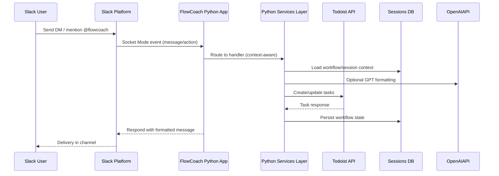
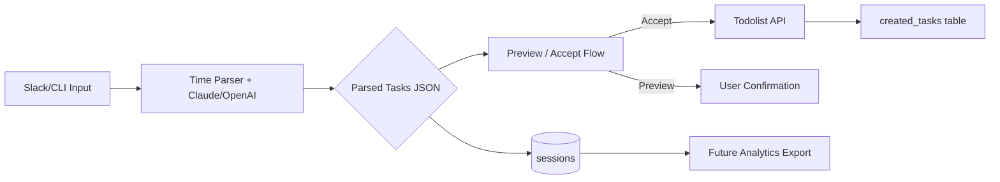
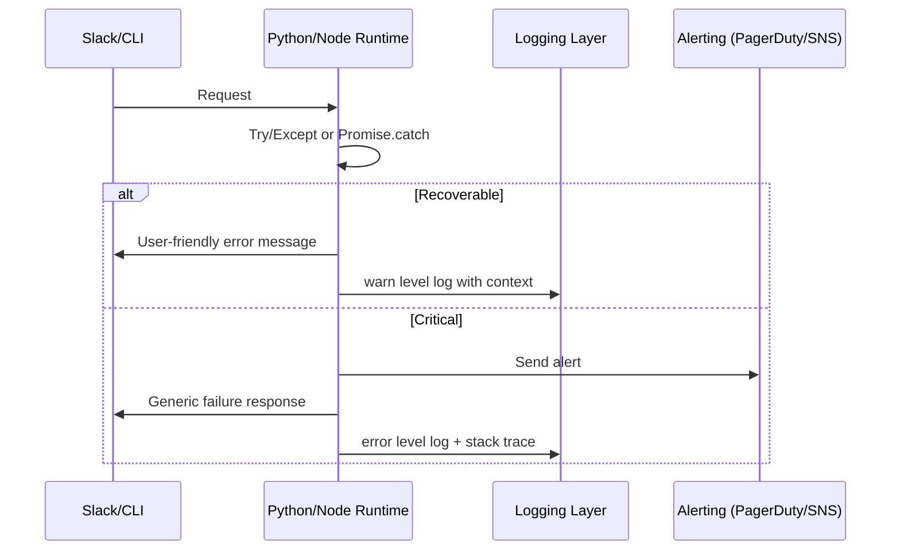

# FlowCoach Fullstack Architecture Document

## Introduction
This document outlines the complete fullstack architecture for FlowCoach, including backend systems, frontend implementation, and their integration. It serves as the single source of truth for AI-driven development, ensuring consistency across the entire technology stack.

This unified approach combines what would traditionally be separate backend and frontend architecture documents, streamlining the development process for modern fullstack applications where these concerns are increasingly intertwined.

### Starter Template or Existing Project
Brownfield foundation built from an existing Python Slack bot (Socket Mode) that orchestrates Slack Bolt, Todoist, OpenAI services, plus a newer Node/TypeScript CLI stack (FlowCoach v2) using Claude and Todoist APIs. No external starter template; architecture evolved organically inside this repository.

### Change Log
| Date       | Version | Description                                 | Author              |
|------------|---------|---------------------------------------------|---------------------|
| 2025-10-15 | v2.0    | Initial fullstack architecture consolidation | Winston (Architect) |

## High Level Architecture

### Technical Summary
FlowCoach runs as a dual-runtime system: a Python Slack bot that listens via Socket Mode and handles real-time interactions, and a Node/TypeScript CLI service that provides advanced task parsing, Todoist orchestration, and persistence workflows. Both runtimes share a SQLite database (`flowcoach.db`) for workflow/session state and rely on external productivity APIs (Todoist, Slack, OpenAI/Anthropic). Deployment targets containerized workloads on AWS Fargate (recommended) with managed SQLite replacement (Aurora Serverless PostgreSQL). The architecture prioritizes deterministic parsing, idempotent task creation, and clear separation between messaging interfaces (Slack/CLI) and orchestration logic.

### Platform and Infrastructure Choice
**Option 1 – AWS Fargate + Aurora Serverless (Recommended):**  
Pros: Scales automatically, native Secrets Manager, mature Slack/Todoist integrations, simple container deploy.  
Cons: Higher baseline cost than hobby tier, requires IaC discipline.

**Option 2 – Fly.io + Litestream SQLite replication:**  
Pros: Lightweight, keeps SQLite, simple global deploy.  
Cons: Less native support for secret rotation, fewer managed observability tools.

**Option 3 – Heroku + SQLite plugin (Dev) ➜ PostgreSQL (Prod):**  
Pros: Quick to prototype, buildpacks for Python & Node.  
Cons: Scaling Socket Mode workers limited, requires split dynos for dual runtimes.

**Platform:** AWS Fargate  
**Key Services:** ECS Fargate, Aurora Serverless PostgreSQL (RDS), Secrets Manager, CloudWatch Logs, AWS Lambda (scheduled maintenance), Amazon EventBridge (cron), AWS Backup  
**Deployment Host and Regions:** Primary `us-east-1`, optional DR `us-west-2`

### Repository Structure
Monorepo structure keeps Python Slack bot, TypeScript CLI, and shared assets together for coordinated refactors and shared documentation.

```
Flowcoach2/
├── app.py                  # Python Slack Bolt entrypoint
├── services/               # Python service adapters (Todoist, OpenAI, calendar)
├── core/                   # BMAD-inspired agent framework (Python)
├── src/                    # Node/TypeScript CLI (FlowCoach v2)
│   ├── cli.ts              # CLI entrypoint
│   ├── core/flowcoach.ts   # Orchestration engine
│   ├── services/           # Claude, Todoist, Session, Thread state services
│   └── types/              # Shared TypeScript type definitions
├── framework/              # Shared agent infrastructure (Python)
├── docs/                   # Architecture & process documentation
└── workflows/, templates/  # Agent workflows and prompt templates
```

Decisions: maintain monorepo to share configuration (`flowcoach.db`, `.env`), allow cross-language workflows, and support unified CI/CD. Nx/Turborepo deemed unnecessary given modest package count; rely on npm workspaces for TS and poetry/pip for Python.

### Environment Strategy
| Environment | Purpose                          | Runtime Targets                                  | Data Strategy                                      | Notes |
|-------------|----------------------------------|--------------------------------------------------|----------------------------------------------------|-------|
| Local       | Developer experimentation        | Python virtualenv + ts-node                      | Local SQLite `flowcoach.db`, mock API keys         | Leverage `.env.local`; disable outbound API with toggles |
| Staging     | Pre-production validation        | ECS Fargate (1 task per runtime)                 | Aurora Serverless staging schema, feature flags    | Mirror Slack workspace with test bot tokens |
| Production  | Live Slack + CLI users           | ECS Fargate with autoscaling (min 2 tasks each)  | Aurora Serverless prod schema, encrypted backups   | Secrets from AWS Secrets Manager; strict IAM roles |

Configuration management handled via `.env` files locally, SSM Parameter Store/Secrets Manager in cloud. Terraform defines environment parity.

### Component Diagram
```mermaid
graph TD
    subgraph Client Surfaces
        Slack[Slack Workspace Users]
        CLI[Local CLI User]
    end

    subgraph Runtime Layer
        PyApp[Python Slack App (Slack Bolt)]
        NodeApp[Node CLI Orchestrator]
    end

    subgraph Shared Services
        SQLite[(Sessions DB)]
        Config[Secrets Manager / .env]
    end

    Slack -->|Socket Mode| PyApp
    CLI -->|ts-node CLI| NodeApp

    PyApp -->|REST APIs| SlackAPI[Slack Web API]
    PyApp --> TodoistAPI[Todoist API]
    PyApp --> OpenAIAPI[OpenAI API]

    NodeApp --> AnthropicAPI[Claude API]
    NodeApp --> TodoistAPI
    NodeApp --> SQLite
    PyApp --> SQLite
    Config --> PyApp
    Config --> NodeApp
```

### Request Lifecycle


CLI pathway mirrors lifecycle with `NodeApp` orchestrating Anthropic parsing before hitting Todoist/DB.

## Domain & Data Architecture

### Domain Overview
The domain centers on personal productivity coaching: capturing tasks from natural language, enriching with GTD metadata, and synchronizing with Todoist. Key aggregates include Sessions (grouping user interactions), Parsed Tasks (structured representations), Workflows (multi-step coaching flows), and Integrations (Slack, Todoist).

### Core Domain Entities
| Entity            | Description                                                         | Source of Truth | Notes |
|-------------------|---------------------------------------------------------------------|-----------------|-------|
| Session           | Capture of a user interaction batch, including parsed tasks         | SQLite `sessions` table / `SessionService` | Links to user, status, created task IDs |
| ParsedTask        | Structured task with duration buckets and GTD flags                 | Stored JSON in sessions + TypeScript types | Derived via deterministic parser + Claude |
| WorkflowState     | Persisted progress for multi-step flows (e.g., breakdown)           | SQLite `workflow_states` table             | Shared by Python agents |
| TodoistTask       | Remote task record in Todoist                                       | Todoist API                                   | Idempotency ensured via title hash |
| ThreadState       | Slack conversation context (last intent, created tasks)             | SQLite `thread_state` via `ThreadStateService` | Guides follow-up responses |

### Data Flow


### Data Models
Primary persistence lives in SQLite; recommended migration to Aurora Postgres keeps structure similar.

```sql
CREATE TABLE sessions (
  id TEXT PRIMARY KEY,
  user_id TEXT NOT NULL,
  input_text TEXT NOT NULL,
  parsed_json TEXT NOT NULL,
  status TEXT NOT NULL DEFAULT 'pending',
  created_task_ids TEXT,
  created_at INTEGER NOT NULL,
  updated_at INTEGER NOT NULL
);

CREATE TABLE created_tasks (
  session_id TEXT NOT NULL,
  title_hash TEXT NOT NULL,
  todoist_id TEXT,
  task_data TEXT,
  created_at INTEGER NOT NULL,
  PRIMARY KEY (session_id, title_hash),
  FOREIGN KEY (session_id) REFERENCES sessions(id)
);
```

Python workflow persistence mirrors this schema with timestamp expiration. Data types chosen for portability; move to Postgres should convert timestamps to `TIMESTAMP WITH TIME ZONE`.

### Data Retention & Compliance
- **Session retention:** 30 days in staging, 90 days in production; scheduled Lambda purges `sessions` and `created_tasks` beyond SLA.  
- **Workflow states:** Expire after 24 hours automatically; enforce via `expires_at` index + nightly cleanup.  
- **PII:** Slack user IDs stored; treat as personal data. Secrets stored in Secrets Manager, never committed.  
- **Backups:** Automated snapshots via RDS; SQLite local backups handled via Litestream when running outside AWS.  
- **Compliance considerations:** Document data flow for Todoist API (EU customers) and ensure DPAs are signed.

## Integration Architecture

### External Integrations
| Integration | Purpose | Protocol | Auth | Rate Limits / Considerations |
|-------------|---------|----------|------|------------------------------|
| Slack (Bolt + Web API) | Receive messages/actions, send responses | WebSockets (Socket Mode) + HTTPS | OAuth tokens (`SLACK_BOT_TOKEN`, `SLACK_APP_TOKEN`) | Socket Mode requires stable outbound connection; respect events-per-second quotas |
| Todoist API | Create/update tasks | HTTPS REST | Personal API token | Use idempotent hashes to avoid duplicates; apply exponential backoff |
| OpenAI Chat Completions | Format GTD tasks | HTTPS REST | API key | Temperature kept low (0.7); guardrails for failures |
| Anthropic Claude | Advanced parsing & breakdown | HTTPS REST | API key | Batch requests sequentially; log prompt/response metadata for debugging |
| Calendar Providers (planned) | Focus block scheduling | HTTPS REST | OAuth tokens stored per user | Pipeline not yet active; design for token refresh storage |

### Async & Background Workloads
Current system executes synchronously within request lifecycle. Planned enhancements:
- **EventBridge scheduled Lambda** to retry failed Todoist pushes.
- **SQS queue** for heavy breakdown requests to avoid Slack timeout (future).

### API Gateway & Routing
- Slack events handled via Socket Mode; no inbound HTTP required.
- CLI commands execute locally; future remote CLI/API should expose Express/FastAPI with authenticated endpoints.

## Infrastructure & Deployment

### Runtime Stack
| Layer         | Technology Choices                              | Rationale |
|---------------|-------------------------------------------------|-----------|
| Python Runtime| Python 3.11, Slack Bolt, `slack_bolt.adapter.socket_mode`, `TodoistAPI`, `openai` | Mature Slack ecosystem, existing codebase |
| Node Runtime  | Node 20 LTS, TypeScript, `ts-node`, Anthropic SDK, SQLite3 | Rapid iteration for CLI + advanced parsing |
| Database      | SQLite (dev) ➜ Aurora Serverless PostgreSQL     | Simple local dev, managed durability in production |
| Container Base| Distroless Python & Node images (multi-stage)   | Reduce attack surface |

### Infrastructure Topology
```
            +---------------------------+
            | AWS Route53 (CLI endpoint)|
            +-------------+-------------+
                          |
                    +-----v------+
                    | ALB (HTTPS)|  <-- optional for hosted CLI/API
                    +-----+------+
                          |
      +-------------------+-------------------+
      |                                       |
+-----v-----+                         +-------v-------+
| Fargate   |                         | Fargate       |
| Service A |  Python Slack Worker    | Service B     |  Node Orchestrator
+-----+-----+                         +-------+-------+
      |                                       |
      | Secret Manager / Parameter Store      |
      |                                       |
      |          +----------------------------v-------------+
      |          | Aurora Serverless (sessions, workflows)  |
      |          +-----------------+------------------------+
      |                            |
      |                   +--------v--------+
      |                   | CloudWatch Logs |
      |                   +-----------------+
```

### Deployment Pipeline
1. GitHub Actions workflow per runtime.  
2. Lint, unit tests, integration tests.  
3. Build Docker images, push to ECR.  
4. Terraform apply (ECS service updates, database migrations via Flyway/Alembic).  
5. Post-deploy smoke tests (Slack bot handshake, CLI parse script).

Blue/green deployments via ECS CodeDeploy to avoid downtime. Rollback triggered on failed health checks or alarm breaches.

## Frontend Architecture

### Client Overview
- **Slack UI:** Interactive message responses, buttons, and dialogues handled via Slack Bolt actions. No custom web UI.  
- **CLI:** Node-based CLI for power users/testing; outputs Markdown/text in terminal.  
- **Future UI Considerations:** Potential Next.js dashboard for reporting.

### Frontend Components
| Component               | Description | Stack |
|-------------------------|-------------|-------|
| Slack Message Renderer  | Formats replies (core/templates) | Python Jinja-lite patterns |
| CLI Output Formatter    | Converts parsed tasks to human-readable preview | TypeScript string formatting |

### State Management & Data Fetching
- Slack frontend relies on backend state; no client storage.  
- CLI fetches from local SQLite via services; ephemeral per run.  
- Introduce GraphQL/REST once dashboard exists.

### Routing & Navigation
- Slack: Command keywords (`organize`, `accept`, `breakdown`) and interactive buttons drive flows.  
- CLI: Command-line arguments route to methods inside `FlowCoach`.

### Accessibility & UX
- Slack messages follow GTD tagging `[2min]` style; ensure alt text for attachments.  
- CLI uses concise text, highlight states with Unicode icons (✅, ⚠️).  
- Document keyboard-focused improvements for future web UI.

## Backend Architecture

### Services Overview
- `app.py`: initializes Slack Bolt app, registers handlers, starts Socket Mode.  
- `services/` (Python): wrappers for OpenAI, Todoist, calendar (planned), workflow persistence.  
- `core/` and `framework/`: BMAD-inspired agent infrastructure to coordinate workflows.  
- `src/core/flowcoach.ts`: orchestrates parsing, session creation, Todoist operations for CLI.  
- TypeScript services provide Claude integration, session persistence, Todoist API client, thread state.

### Application Layer
- Python handlers map Slack events to BMAD agents, ensuring consistent workflows across surfaces.  
- CLI orchestrator enforces preview → accept pipeline with idempotency.

### Domain Layer
- Domain logic (task parsing, GTD tagging) resides in TypeScript `FlowCoach` class and Python `core/task_agent`.  
- Agents pattern enables plugging new flows without modifying handler core.

### Infrastructure Layer
- Services encapsulate external APIs with logging and error handling (`OpenAIService`, `TodoistService`, `ClaudeService`).  
- SQLite persistence via `SessionService`/`WorkflowPersistenceService`.

## Shared Components & Configuration

### Shared Libraries
- `.bmad-core/` templates + tasks ensure consistent agent behavior.  
- `framework/` exposes reusable base agent classes for Python.  
- TypeScript `types/core.ts` standardizes data contracts for CLI.

### Configuration Management
- `.env` for local; `.env.example` recommended (create).  
- `config/config.py` centralizes Python config (feature flags, tokens).  
- TypeScript uses `dotenv` in CLI; environment variables required before run.  
- Secrets pulled via AWS Secrets Manager in prod.

### Feature Flags
- `FEATURES` dictionary (Python) for gating features (e.g., `email_integration`).  
- `FC_PREVIEW_MODE` env var toggles CLI preview vs auto-create.  
- Plan: unify via LaunchDarkly or simple database-driven flags.

## Security Architecture

### Identity & Access
- Slack tokens stored encrypted; minimal scopes (commands, chat:write, app_mentions).  
- Todoist API tokens per environment; rotate quarterly.  
- CLI usage requires local `.env`; consider session-based auth if shipping remote CLI.

### Secrets Management
- Local: `.env`, never committed.  
- Cloud: AWS Secrets Manager with IAM roles limiting access to respective ECS tasks.  
- Rotate keys automatically via AWS rotation or manual runbooks.

### Data Protection
- Enforce TLS 1.2+ for outbound API calls (default).  
- Database encryption at rest (Aurora).  
- Logging scrubs task text when flagged as sensitive (future improvement).

### Threat Modeling & Mitigation
- **Risk:** Slack Socket Mode disconnect ➜ Mitigation: health checks, auto-reconnect, CloudWatch alarm.  
- **Risk:** Todoist API rate limiting ➜ Mitigation: exponential backoff, queued retries.  
- **Risk:** Prompt injection ➜ Mitigation: sanitize untrusted text, limit LLM instructions, run content filters.  
- **Risk:** API key leakage ➜ Mitigation: strict IAM, secret rotation, environment variable scanning in CI.

## Scaling & Reliability

### Scaling Strategy
- Horizontal scaling via ECS task count; Python and Node runtimes scale independently.  
- Use CloudWatch metrics (CPU, memory, request latency) to trigger autoscaling policies.  
- For Slack, ensure single Socket Mode connection per workspace; scale via sharding across workspaces if needed.

### Performance Considerations
- Offload heavy parsing to Claude only when deterministic parser insufficient.  
- Cache Todoist projects/labels in memory to reduce API calls.  
- SQLite replaced with Postgres to avoid locking under concurrency.

### Reliability Patterns
- Idempotent task creation (hash-based).  
- Graceful shutdown via signal handlers in Python.  
- Dead-letter queue planned for failed background jobs.  
- Health checks hitting `/healthz` endpoints (add to runtimes).

## Developer Workflow

### Repo Standards
- Python formatting via `black`, lint with `flake8`.  
- TypeScript lint via `eslint`, format with `prettier`.  
- `pre-commit` hook recommended to run both.  
- Branch naming: `feature/<slug>`, `fix/<slug>`.

### Local Development
1. `pip install -r requirements.txt` & `npm install`.  
2. Copy `.env.example` ➜ `.env`, fill tokens (or mocks).  
3. Run Slack bot: `python app.py`.  
4. Run CLI: `npm run dev -- organize "<tasks>"`.  
5. Use `flowcoach.db` for local persistence; reset with `rm flowcoach.db` if needed.

### CI/CD Workflow
- GitHub Actions pipeline stages: `lint`, `test`, `build`, `package`, `deploy`.  
- Secrets stored in repo environment (use OpenID Connect -> AWS).  
- Require PR approval + status checks.

### Release Management
- Semantic versioning applied to CLI and Slack bot; tag repository on release.  
- Change log maintained in this architecture doc + `ROADMAP.md`.  
- Use feature flags for dark launches.

## Testing Strategy

### Testing Pyramid
```
Frontend Unit   Backend Unit
      ^              ^
      |        Integration (Slack command flows, CLI accept flow)
      |                ^
      +-------- E2E (CLI organize ➜ Todoist mock, Slack smoke tests)
```

### Test Organization
- Python: `tests/` directory with pytest.  
- TypeScript: `test-parser.ts`, `test-calendar.ts`; expand with vitest/jest suites.  
- E2E: mock Slack events + local CLI acceptance using fixture Todoist responses.

### Test Examples

Frontend Tests (CLI formatting)  
```typescript
import { formatPreview } from '../src/core/formatting';
// Assert durations and emojis render correctly for quick wins and projects.
```

Backend Tests (Python handler)  
```python
def test_handle_organize_message(mock_slack_client, todoist_stub):
    # Validate session creation and Todoist enqueue logic.
```

E2E Test (CLI organize flow)  
```typescript
it('organizes tasks and persists session', async () => {
  const response = await flowcoach.organize('email Sam - 10 min', 'test_user');
  expect(response.type).toBe('preview');
  const session = await sessionService.getLastPendingSession('test_user');
  expect(session).not.toBeNull();
});
```

## Coding Standards

### Critical Fullstack Rules
- **Deterministic Time Parsing First:** Always run structured parser before LLM calls to keep duration buckets reliable.
- **Idempotent Todoist Writes:** Derive `title_hash` consistently; never create Todoist tasks without duplicate check.
- **Centralized Config Access:** Use `config.get_config()` (Python) or environment accessors (TS) rather than `process.env` scattering.
- **Workflow State TTL:** Ensure workflow states set `expires_at`; cleanup jobs must run daily.

### Naming Conventions
| Element             | Frontend (CLI/Slack) | Backend (Python/TS) | Example              |
|---------------------|----------------------|---------------------|----------------------|
| Components          | PascalCase           | -                   | `TaskPreview.tsx`    |
| Hooks/Helpers       | camelCase with `use` | -                   | `useTodoistClient.ts`|
| API Routes          | -                    | kebab-case          | `/api/user-profile`  |
| Database Tables     | -                    | snake_case          | `created_tasks`      |

## Error Handling Strategy

### Error Flow


### Error Response Format
```typescript
interface ApiError {
  error: {
    code: string;
    message: string;
    details?: Record<string, any>;
    timestamp: string;
    requestId: string;
  };
}
```

### Frontend Error Handling
```typescript
export function handleCliError(err: unknown) {
  const requestId = crypto.randomUUID();
  console.error(`[${requestId}]`, err);
  return `❌ Sorry, something went wrong (ref: ${requestId}). Try again or contact support.`;
}
```

### Backend Error Handling
```python
def safe_todoist_call(fn, *args, **kwargs):
    try:
        return fn(*args, **kwargs)
    except TodoistError as err:
        logger.warning("Todoist API failure", extra={"error": str(err)})
        raise FlowCoachServiceError("todoist_error", str(err)) from err
```

## Monitoring and Observability

### Monitoring Stack
- **Frontend Monitoring:** Slack interaction metrics via custom CloudWatch dashboards; CLI usage tracked via structured logs.
- **Backend Monitoring:** CloudWatch metrics (CPU, memory, invocation counts), ECS Container Insights.
- **Error Tracking:** Sentry (recommended) for Python & Node runtimes with shared project.
- **Performance Monitoring:** AWS X-Ray for tracing Todoist/OpenAI latency; Loki/Grafana optional for log exploration.

### Key Metrics
**Frontend Metrics:**
- Core Web Vitals: N/A (no web front). Track Slack command latency instead.
- JavaScript errors: CLI stderr incidents.
- API response times: CLI command duration histogram.
- User interactions: Slack command counts, CLI invocations per user.

**Backend Metrics:**
- Request rate: Slack events processed/min.
- Error rate: Todoist/OpenAI failure ratio.
- Response time: Slack handler execution time, CLI organize duration.
- Database query performance: Session insert latency, pending session queries.

## Checklist Results Report
Checklist pending. After document approval, run `*execute-checklist architect-checklist` and record PASS/CONCERNS outcomes here.
