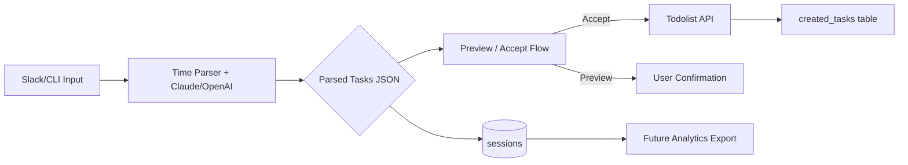

# Domain & Data Architecture

## Domain Overview
The domain centers on personal productivity coaching: capturing tasks from natural language, enriching with GTD metadata, and synchronizing with Todoist. Key aggregates include Sessions (grouping user interactions), Parsed Tasks (structured representations), Workflows (multi-step coaching flows), and Integrations (Slack, Todoist).

## Core Domain Entities
| Entity            | Description                                                         | Source of Truth | Notes |
|-------------------|---------------------------------------------------------------------|-----------------|-------|
| Session           | Capture of a user interaction batch, including parsed tasks         | SQLite `sessions` table / `SessionService` | Links to user, status, created task IDs |
| ParsedTask        | Structured task with duration buckets and GTD flags                 | Stored JSON in sessions + TypeScript types | Derived via deterministic parser + Claude |
| WorkflowState     | Persisted progress for multi-step flows (e.g., breakdown)           | SQLite `workflow_states` table             | Shared by Python agents |
| TodoistTask       | Remote task record in Todoist                                       | Todoist API                                   | Idempotency ensured via title hash |
| ThreadState       | Slack conversation context (last intent, created tasks)             | SQLite `thread_state` via `ThreadStateService` | Guides follow-up responses |

## Data Flow


## Data Models
Primary persistence lives in SQLite; recommended migration to Aurora Postgres keeps structure similar.

```sql
CREATE TABLE sessions (
  id TEXT PRIMARY KEY,
  user_id TEXT NOT NULL,
  input_text TEXT NOT NULL,
  parsed_json TEXT NOT NULL,
  status TEXT NOT NULL DEFAULT 'pending',
  created_task_ids TEXT,
  created_at INTEGER NOT NULL,
  updated_at INTEGER NOT NULL
);

CREATE TABLE created_tasks (
  session_id TEXT NOT NULL,
  title_hash TEXT NOT NULL,
  todoist_id TEXT,
  task_data TEXT,
  created_at INTEGER NOT NULL,
  PRIMARY KEY (session_id, title_hash),
  FOREIGN KEY (session_id) REFERENCES sessions(id)
);
```

Python workflow persistence mirrors this schema with timestamp expiration. Data types chosen for portability; move to Postgres should convert timestamps to `TIMESTAMP WITH TIME ZONE`.

## Data Retention & Compliance
- **Session retention:** 30 days in staging, 90 days in production; scheduled Lambda purges `sessions` and `created_tasks` beyond SLA.  
- **Workflow states:** Expire after 24 hours automatically; enforce via `expires_at` index + nightly cleanup.  
- **PII:** Slack user IDs stored; treat as personal data. Secrets stored in Secrets Manager, never committed.  
- **Backups:** Automated snapshots via RDS; SQLite local backups handled via Litestream when running outside AWS.  
- **Compliance considerations:** Document data flow for Todoist API (EU customers) and ensure DPAs are signed.
