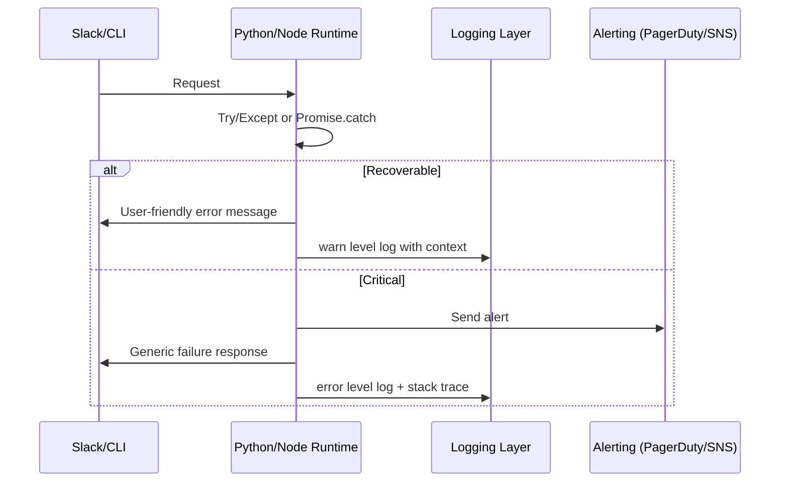

# Error Handling Strategy

## Error Flow


## Error Response Format
```typescript
interface ApiError {
  error: {
    code: string;
    message: string;
    details?: Record<string, any>;
    timestamp: string;
    requestId: string;
  };
}
```

## Frontend Error Handling
```typescript
export function handleCliError(err: unknown) {
  const requestId = crypto.randomUUID();
  console.error(`[${requestId}]`, err);
  return `❌ Sorry, something went wrong (ref: ${requestId}). Try again or contact support.`;
}
```

## Backend Error Handling
```python
def safe_todoist_call(fn, *args, **kwargs):
    try:
        return fn(*args, **kwargs)
    except TodoistError as err:
        logger.warning("Todoist API failure", extra={"error": str(err)})
        raise FlowCoachServiceError("todoist_error", str(err)) from err
```
