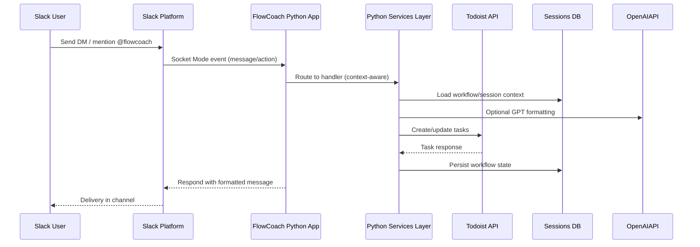

# High Level Architecture

## Technical Summary
FlowCoach runs as a dual-runtime system: a Python Slack bot that listens via Socket Mode and handles real-time interactions, and a Node/TypeScript CLI service that provides advanced task parsing, Todoist orchestration, and persistence workflows. Both runtimes share a SQLite database (`flowcoach.db`) for workflow/session state and rely on external productivity APIs (Todoist, Slack, OpenAI/Anthropic). Deployment targets containerized workloads on AWS Fargate (recommended) with managed SQLite replacement (Aurora Serverless PostgreSQL). The architecture prioritizes deterministic parsing, idempotent task creation, and clear separation between messaging interfaces (Slack/CLI) and orchestration logic.

## Platform and Infrastructure Choice
**Option 1 – AWS Fargate + Aurora Serverless (Recommended):**  
Pros: Scales automatically, native Secrets Manager, mature Slack/Todoist integrations, simple container deploy.  
Cons: Higher baseline cost than hobby tier, requires IaC discipline.

**Option 2 – Fly.io + Litestream SQLite replication:**  
Pros: Lightweight, keeps SQLite, simple global deploy.  
Cons: Less native support for secret rotation, fewer managed observability tools.

**Option 3 – Heroku + SQLite plugin (Dev) ➜ PostgreSQL (Prod):**  
Pros: Quick to prototype, buildpacks for Python & Node.  
Cons: Scaling Socket Mode workers limited, requires split dynos for dual runtimes.

**Platform:** AWS Fargate  
**Key Services:** ECS Fargate, Aurora Serverless PostgreSQL (RDS), Secrets Manager, CloudWatch Logs, AWS Lambda (scheduled maintenance), Amazon EventBridge (cron), AWS Backup  
**Deployment Host and Regions:** Primary `us-east-1`, optional DR `us-west-2`

## Repository Structure
Monorepo structure keeps Python Slack bot, TypeScript CLI, and shared assets together for coordinated refactors and shared documentation.

```
Flowcoach2/
├── app.py                  # Python Slack Bolt entrypoint
├── services/               # Python service adapters (Todoist, OpenAI, calendar)
├── core/                   # BMAD-inspired agent framework (Python)
├── src/                    # Node/TypeScript CLI (FlowCoach v2)
│   ├── cli.ts              # CLI entrypoint
│   ├── core/flowcoach.ts   # Orchestration engine
│   ├── services/           # Claude, Todoist, Session, Thread state services
│   └── types/              # Shared TypeScript type definitions
├── framework/              # Shared agent infrastructure (Python)
├── docs/                   # Architecture & process documentation
└── workflows/, templates/  # Agent workflows and prompt templates
```

Decisions: maintain monorepo to share configuration (`flowcoach.db`, `.env`), allow cross-language workflows, and support unified CI/CD. Nx/Turborepo deemed unnecessary given modest package count; rely on npm workspaces for TS and poetry/pip for Python.

## Environment Strategy
| Environment | Purpose                          | Runtime Targets                                  | Data Strategy                                      | Notes |
|-------------|----------------------------------|--------------------------------------------------|----------------------------------------------------|-------|
| Local       | Developer experimentation        | Python virtualenv + ts-node                      | Local SQLite `flowcoach.db`, mock API keys         | Leverage `.env.local`; disable outbound API with toggles |
| Staging     | Pre-production validation        | ECS Fargate (1 task per runtime)                 | Aurora Serverless staging schema, feature flags    | Mirror Slack workspace with test bot tokens |
| Production  | Live Slack + CLI users           | ECS Fargate with autoscaling (min 2 tasks each)  | Aurora Serverless prod schema, encrypted backups   | Secrets from AWS Secrets Manager; strict IAM roles |

Configuration management handled via `.env` files locally, SSM Parameter Store/Secrets Manager in cloud. Terraform defines environment parity.

## Component Diagram
```mermaid
graph TD
    subgraph Client Surfaces
        Slack[Slack Workspace Users]
        CLI[Local CLI User]
    end

    subgraph Runtime Layer
        PyApp[Python Slack App (Slack Bolt)]
        NodeApp[Node CLI Orchestrator]
    end

    subgraph Shared Services
        SQLite[(Sessions DB)]
        Config[Secrets Manager / .env]
    end

    Slack -->|Socket Mode| PyApp
    CLI -->|ts-node CLI| NodeApp

    PyApp -->|REST APIs| SlackAPI[Slack Web API]
    PyApp --> TodoistAPI[Todoist API]
    PyApp --> OpenAIAPI[OpenAI API]

    NodeApp --> AnthropicAPI[Claude API]
    NodeApp --> TodoistAPI
    NodeApp --> SQLite
    PyApp --> SQLite
    Config --> PyApp
    Config --> NodeApp
```

## Request Lifecycle


CLI pathway mirrors lifecycle with `NodeApp` orchestrating Anthropic parsing before hitting Todoist/DB.
