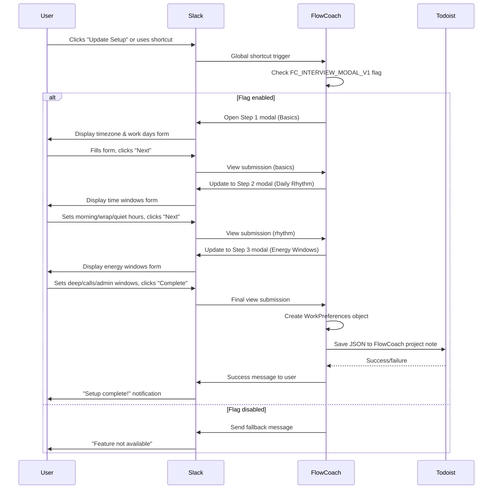

# Interview Flow

The FlowCoach interview is a 3-step modal that collects user preferences for personalized productivity.

## Overview

**Purpose:** Collect user work preferences to enable intelligent task scheduling and notifications.

**Trigger:** Global shortcut `/flowcoach_setup` or "Update Setup" button on Home tab

**Result:** WorkPreferences saved to Todoist project note

## Sequence Diagram



## Step Details

### Step 1: Basics

**Fields:**

- Timezone (dropdown): EST, CST, MST, PST, UTC
- Work days (checkboxes): Mon-Sun, default M-F selected

**Validation:**

- Timezone required
- At least one work day required

### Step 2: Daily Rhythm

**Fields:**

- Morning brief window: start/end times
- Evening wrap window: start/end times
- Quiet hours: start/end times (no notifications)

**Defaults:**

- Morning: 07:00-10:00
- Evening: 16:00-18:00
- Quiet: 18:00-09:00

**Validation:**

- All times required
- Start time must be before end time
- Times must be valid HH:MM format

### Step 3: Energy Windows

**Fields:**

- Deep work: start time + duration (60/90/120 min)
- Calls: start time + duration (60/90/120 min)
- Admin: start time + duration (30/60/90 min)

**Defaults:**

- Deep: 09:00 for 90 minutes
- Calls: 14:00 for 60 minutes
- Admin: 16:00 for 30 minutes

**Validation:**

- All windows required
- No overlap validation (future enhancement)
- Duration must be positive

## Data Transformation

Interview form data → WorkPreferences:

```python
# Energy window end time calculation
start_hour, start_min = map(int, start_time.split(":"))
duration_mins = selected_duration
end_total_mins = (start_hour * 60 + start_min + duration_mins)
end_hour = (end_total_mins // 60) % 24
end_min = end_total_mins % 60
end_time = f"{end_hour:02d}:{end_min:02d}"

# Create EnergyWindow objects
energy_windows = [
    EnergyWindow(name, start_time, end_time, duration_mins)
    for name, start_time, duration_mins in windows_data
]
```

## Storage Format

Final preferences stored as JSON in Todoist:

```json
{
  "user_id": "U123456",
  "version": "1.0",
  "preferences": {
    "timezone": "America/New_York",
    "work_days": "mon,tue,wed,thu,fri",
    "morning_window_start": "08:00",
    "morning_window_end": "10:00",
    "wrap_window_start": "17:00",
    "wrap_window_end": "19:00",
    "quiet_hours_start": "19:00",
    "quiet_hours_end": "08:00",
    "energy_windows": [
      {
        "name": "deep",
        "start_time": "09:00",
        "end_time": "10:30",
        "max_session_minutes": 90
      },
      {
        "name": "calls",
        "start_time": "14:00",
        "end_time": "15:00",
        "max_session_minutes": 60
      },
      {
        "name": "admin",
        "start_time": "16:00",
        "end_time": "16:30",
        "max_session_minutes": 30
      }
    ]
  }
}
```

## Error Handling

**Modal errors:**

- Missing required fields → validation message
- Invalid time format → validation message
- Todoist save failure → "Setup failed, try again"

**Feature flag disabled:**

- Global shortcut → "Feature not available"
- Home tab button → hidden/disabled

**Recovery:**

- User can restart interview anytime
- Previous preferences overwritten on completion
- Graceful degradation if Todoist unavailable

## Future Enhancements

**Phase 1+:**

- Energy window overlap detection
- Smart default suggestions based on timezone
- Import from calendar for better time estimates
- Preview of how preferences affect scheduling
